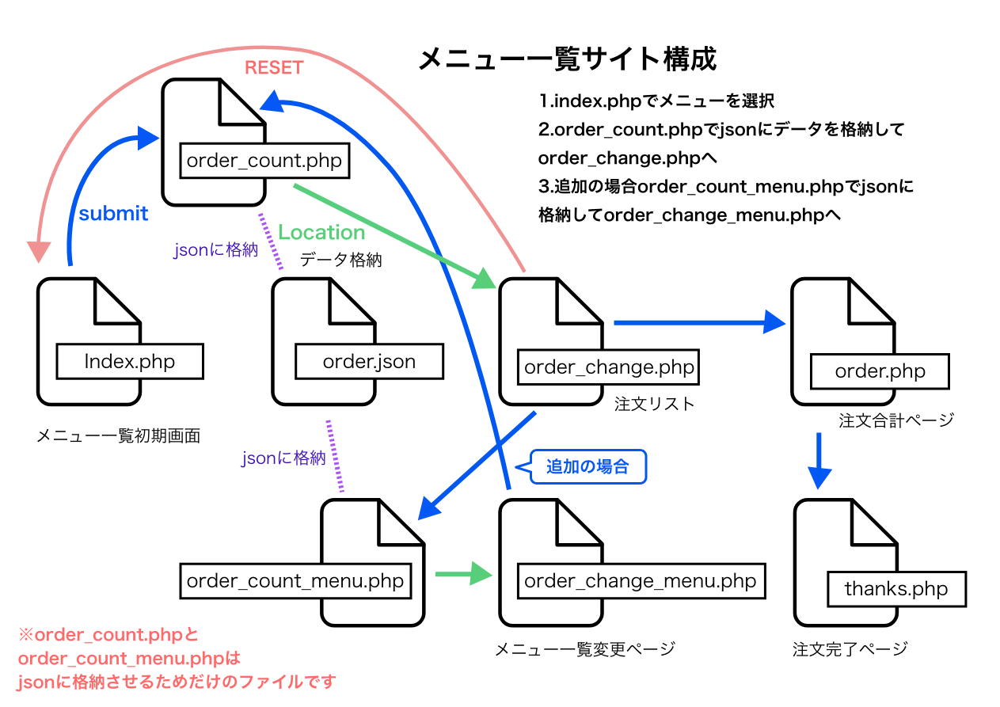

# menulist
## テストメニュ一覧システム概要
 

|格納ファイル&フォルダ |ページor機能
|--|--
|index.php |トップページ
|order_count.php |トップとメニュー変更からのデータをjsonに格納
|order_change.php |注⽂リスト
|order_count_menu.php |注⽂リストからのデータをjsonに格納
|order_change_menu.php |メニュー変更
|order.php |注文合計
|thanks.php |完了
|order.json |submitによるデータ格納
|image |アイコンなどのサイト画像
|menulist.sql |MySQL定義のみメニューテーブル
|control |管理画面と共通インクルードの格納フォルダ
|common |CSS、js格納フォルダ
 

|controlフォルダ |管理画面データ&共通パーツ
|-- |--
|index.php |ログインページ
|control_top.php |管理画面トップ 追加入力
|change.php |変更
|change_check.php |変更確認
|delete.php |削除
|logout.php |ログアウト
|db_join.php |共通インクルード DB接続、共通設定格納
|select_cat.php |共通インクルード selectカテゴリーformパーツ
|select_mt.php |共通インクルード select素材formパーツ
|img_up |DBに登録した画像データ格納先フォルダ
 

  

### 注釈
- db_join.phpのDB接続情報はXamppの設定のままになっています。
- submitでページ移行の時、データをjsonに格納しています。削除や個数変更時の際、jsonで上書きさせてデータを保持する為です。 jsonを絡ませていないページは最終データの注文合計とリセットに戻す為のトップページです。
- order_change.php注文リストはDBではなくjsonの書き出しデータです。削除や変更はここまでとします。
- menulist.sqlはテーブル定義のみです。とてもシンプルなテーブルなので不要かとも思いましたが一応付けました。
  
### 制作環境
Mac OS 10.14 PHP Version 7.4 MySQL5.7 
### DEMOサイト
https://mymenu.okamechan.com/menulist/

